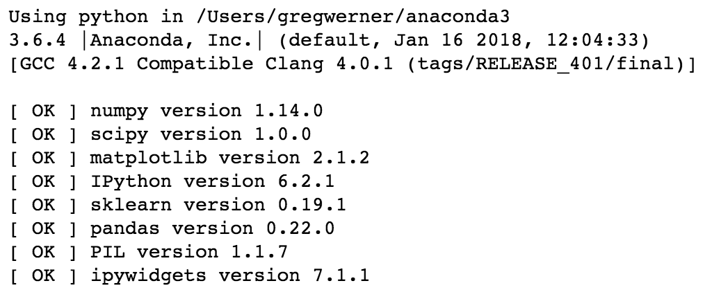
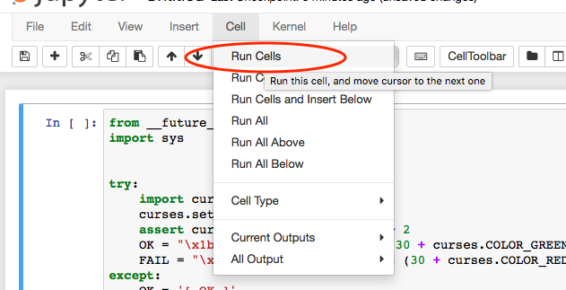

# Enterprise Data World Machine Learning Workshop

Material to accompany Enterprise Data World Introduction to Machine Learning workshop.

Installation Notes
------------------

This tutorial will require recent installations of:

- [NumPy](http://www.numpy.org)
- [SciPy](http://www.scipy.org)
- [matplotlib](http://matplotlib.org)
- [pandas](http://pandas.pydata.org)
- [pillow](https://python-pillow.org)
- [scikit-learn](http://scikit-learn.org/stable/)
- [IPython](http://ipython.readthedocs.org/en/stable/)
- [Jupyter Notebook](http://jupyter.org)

### Anaconda

[Anaconda](https://www.anaconda.com/download/) provides all the dependencies we need for these examples. The code examples in this tutorial should be compatible to Python 2.7, Python 3.4-3.6.

Start your Jupyter Notebook:

```bash
jupyter notebook
```

### Docker

These instructions assume [Docker](https://docs.docker.com/install/) has already been installed on your system.

Download docker image with `scipy` dependencies:

```bash
docker pull jupyter/scipy-stack
```

Run the docker image:

```bash
docker run -v $(pwd):/home/jovyan/work -d -p 8888:8888 jupyter/scipy-notebook
```

Verify Installation
-------------------

There is a notebook file in the `tests` folder which allows you to verify that all dependencies are installed. To run tests, start a `jupyter notebook` session and then run cells:

```bash
jupyter notebook tests/check_env.ipynb
```

Then, run all cells to run tests:



If the tests are successful, you should see an output at the end of your notebook that looks something like so:



Data Downloads
--------------

This repository does not include the datasets required to run some of the notebooks. To download the datasets, run:

```bash
python fetch_data.py
```

These are pretty large files. Once `fetch_data.py` extracts the data to your disk, the ./notebook/dataset folder will take 480 MB.

Credits
-------

A lot of the code is based in large part from the authors below:

- Jason Brownlee's [Machine Learning Master](https://machinelearningmastery.com)
- [Scipy 2017 sklearn Tutorials](https://github.com/amueller/scipy-2017-sklearn) from Alexandre Gramfort and Andreas Mueller
